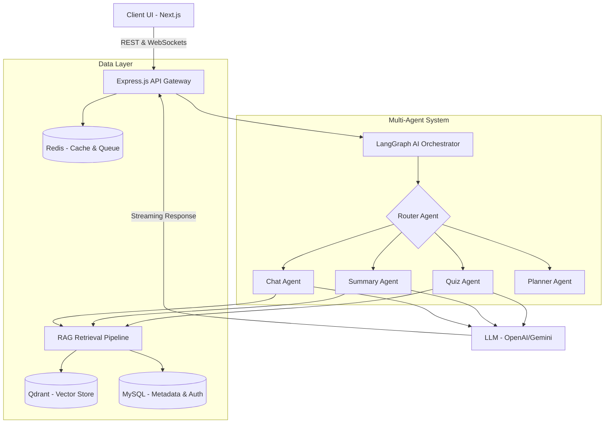

# System Architecture

This document outlines the high-level architecture of the **AI Exam Copilot**. The application is designed to be highly modular, separating the frontend UI, backend orchestration, and AI-agent processing into distinct layers.

## High-Level Diagram

## 🖥️ Frontend (Next.js)

The frontend is built for performance and responsive UX, acting as the user's window into the AI capabilities.

- **Framework**: Next.js 16 (App Router)
- **Language**: TypeScript
- **Styling**: Tailwind CSS & shadcn/ui
- **State Management**: Zustand (for client state), React Query (for server state caching)
- **Animation**: Framer Motion & GSAP
- **Key Responsibilities**:
  - Managing user authentication sessions.
  - Providing a drag-and-drop interface for document uploads.
  - Rendering Markdown and citations in the chat window.
  - Streaming token-by-token responses for a fast perceived latency.

## ⚙️ Backend (Express.js)

The backend acts as the API gateway and the host for the heavy AI logic.

- **Framework**: Node.js & Express.js
- **Language**: TypeScript
- **Queues**: BullMQ & Redis (for handling heavy asynchronous tasks like document embedding and quiz generation without blocking the main thread).
- **Key Responsibilities**:
  - Processing file uploads and parsing (PDFs, DOCX).
  - Interacting with databases (MySQL for relational data, Qdrant for vectors).
  - Establishing WebSocket/SSE connections for streaming AI responses.
  - Orchestrating the AI logic via LangGraph.

## 🤖 AI & RAG Layer

- **Orchestration**: LangGraph manages the state machine and loops between our specialized agents.
- **RAG Pipeline**: 
  1. **Ingestion**: Documents are chunked (e.g., 500-1000 tokens) with overlap.
  2. **Embedding**: Text is converted to dense vectors using OpenAI or Gemini embedding models.
  3. **Retrieval**: Hybrid search (Keyword + Vector similarity) fetches the top-K relevant chunks for user queries.
  4. **Generation**: The LLM forms a response citing the retrieved chunks.

## 🚀 Deployment & Scalability

- **Stateless APIs**: The Express server is entirely stateless (sessions stored in Redis, data in MySQL), meaning it can be scaled horizontally.
- **Worker Nodes**: BullMQ allows us to spin up dedicated worker nodes just for processing documents, keeping the web API snappy.
