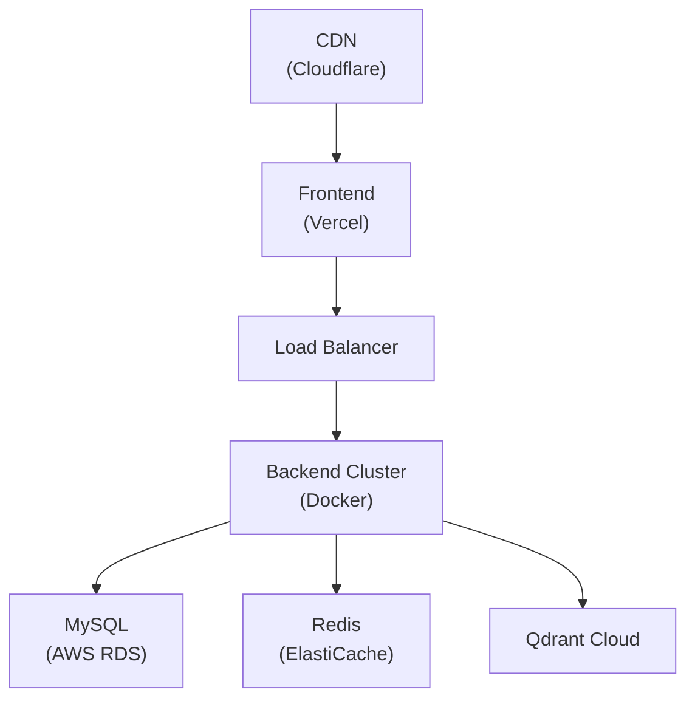

# Deployment Guide

Complete instructions for deploying AI Study Assistant to production environments.

## Production Deployment Architecture



---

## 📦 Frontend Deployment (Vercel)

### Step 1: Push to GitHub
```bash
git push origin main
```

### Step 2: Connect to Vercel
1. Go to [Vercel Dashboard](https://vercel.com/dashboard)
2. Click "Add New..." → "Project"
3. Select your GitHub repository
4. Select `frontend` as root directory

### Step 3: Environment Variables
Set in Vercel Project Settings:
```
NEXT_PUBLIC_API_URL=https://api.yourdomain.com/api/v1
NEXT_PUBLIC_ENV=production
```

### Step 4: Deploy
- Automatic: Every push to `main` triggers deployment
- Manual: Click "Deploy" in Vercel dashboard

### Domain Setup
1. Add your domain in Vercel Project Settings
2. Update DNS records to point to Vercel nameservers
3. Enable HTTPS (automatic with Vercel)

---

## Backend Deployment (Docker + AWS/DigitalOcean)

### Option A: AWS EC2

#### Prerequisites
- AWS Account with EC2 access
- t3.medium or larger instance
- Ubuntu 22.04 LTS

#### Step 1: Launch EC2 Instance
```bash
# On your local machine, create SSH key
ssh-keygen -t rsa -b 4096 -f ~/.ssh/study-assistant-key

# Upload public key to AWS
# Launch instance with 50GB storage minimum
```

#### Step 2: Setup Instance
```bash
# SSH into instance
ssh -i ~/.ssh/study-assistant-key ubuntu@your-instance-ip

# Update system
sudo apt update && sudo apt upgrade -y

# Install Docker & Docker Compose
sudo apt install -y docker.io docker-compose-v2 git nodejs npm

# Add ubuntu to docker group
sudo usermod -aG docker ubuntu

# Logout and login again
exit
```

#### Step 3: Deploy Application
```bash
# Clone repository
git clone https://github.com/prudhvi-1618/AI-Study-Assistant.git
cd AI-Study-Assistant/backend

# Create production .env
cp .env.example .env
# Edit .env with production values:
# - NODE_ENV=production
# - Use managed database credentials
# - Strong JWT secrets
# - Production API keys
nano .env

# Start services
docker-compose up -d

# Run migrations
npm install
npm run db:migrate

# Start backend
npm run build
npm start
```

#### Step 4: Reverse Proxy (Nginx)
```bash
# Install Nginx
sudo apt install -y nginx

# Create Nginx config
sudo nano /etc/nginx/sites-available/default
```

Add to Nginx config:
```nginx
upstream backend {
    server localhost:3001;
}

server {
    listen 80;
    server_name api.yourdomain.com;

    location / {
        proxy_pass http://backend;
        proxy_http_version 1.1;
        proxy_set_header Upgrade $http_upgrade;
        proxy_set_header Connection 'upgrade';
        proxy_set_header Host $host;
        proxy_cache_bypass $http_upgrade;
    }
}
```

```bash
# Reload Nginx
sudo systemctl reload nginx

# Enable HTTPS with Let's Encrypt
sudo apt install -y certbot python3-certbot-nginx
sudo certbot --nginx -d api.yourdomain.com
```

---

### Option B: DigitalOcean App Platform

1. Push code to GitHub
2. Go to DigitalOcean Dashboard → Apps
3. Click "Create App"
4. Select GitHub repository
5. Configure:
   - **Build Command:** `npm install && npm run build`
   - **Run Command:** `npm start`
   - **Environment Variables:** Add .env variables
   - **HTTP Port:** 3001
6. Deploy

---

## Database Setup

### Option A: AWS RDS (Recommended)

#### MySQL Setup
```bash
# Create RDS instance via AWS Console
# - Engine: MySQL 8.0
# - Instance class: db.t3.small or larger
# - Storage: 100GB
# - Multi-AZ: Enabled for production
```

#### Connect & Setup
```bash
# From your backend server
mysql -h your-rds-endpoint.rds.amazonaws.com -u admin -p study_assistant < schema.sql

# Update backend .env
DB_HOST=your-rds-endpoint.rds.amazonaws.com
DB_USER=admin
DB_PASSWORD=your-strong-password
DB_NAME=study_assistant
```

### Option B: AWS ElastiCache for Redis

1. Create ElastiCache cluster (Redis)
2. Enable cluster mode disabled
3. Update backend .env:
```
REDIS_HOST=your-elasticache-endpoint.ng.0001.use1.cache.amazonaws.com
REDIS_PORT=6379
REDIS_PASSWORD=your-auth-token
```

### Option C: Qdrant Cloud

1. Go to [Qdrant Cloud](https://cloud.qdrant.io/)
2. Create cluster (free tier available)
3. Get API key and cluster URL
4. Update backend .env:
```
QDRANT_URL=https://your-cluster.qdrant.io
QDRANT_API_KEY=your-api-key
```

---

## Monitoring & Logs

### CloudWatch (AWS)
```bash
# Install CloudWatch agent on EC2
# Logs streamed automatically to CloudWatch

# View logs
aws logs tail /aws/ec2/study-assistant --follow
```

### Application Monitoring
```bash
# Check backend health
curl https://api.yourdomain.com/api/v1/health

# View Docker logs
docker logs study-assistant-backend -f

# Monitor resources
docker stats
```

---

## Security Setup

### SSL/TLS Certificates
```bash
# Use Let's Encrypt (Free)
sudo certbot certonly --standalone -d api.yourdomain.com

# Or use AWS Certificate Manager
# - Automatic renewal
# - Free for AWS services
```

### Firewall Rules (AWS Security Group)
```
Inbound:
- Port 22 (SSH): Your IP only
- Port 80 (HTTP): 0.0.0.0/0 (redirects to HTTPS)
- Port 443 (HTTPS): 0.0.0.0/0

Outbound:
- All allowed
```

### Environment Secrets
```bash
# Use AWS Secrets Manager
# Store API keys securely instead of in .env

# Or use environment variable store
docker run \
  -e GEMINI_API_KEY=$(aws secretsmanager get-secret-value --secret-id gemini-key --query SecretString --output text) \
  your-image
```

---

## CI/CD Pipeline

### GitHub Actions Example

Create `.github/workflows/deploy.yml`:

```yaml
name: Deploy to Production

on:
  push:
    branches: [main]

jobs:
  test:
    runs-on: ubuntu-latest
    steps:
      - uses: actions/checkout@v2
      - name: Setup Node.js
        uses: actions/setup-node@v2
        with:
          node-version: '20'
      - name: Install dependencies
        run: npm install
      - name: Run tests
        run: npm test

  deploy:
    needs: test
    runs-on: ubuntu-latest
    steps:
      - uses: actions/checkout@v2
      - name: Deploy Frontend
        run: npm run deploy:frontend
      - name: Deploy Backend
        run: npm run deploy:backend
```

---

# Performance Optimization

### Caching Strategy
```bash
# Enable Redis caching for frequently accessed data
REDIS_CACHE_TTL_SECONDS=3600

# Use CDN for static assets
# Set CloudFlare caching rules
```

### Database Optimization
```sql
-- Add indexes for common queries
CREATE INDEX idx_user_id ON documents(user_id);
CREATE INDEX idx_document_id ON flashcards(document_id);
CREATE INDEX idx_user_doc ON quiz_attempts(user_id, topic);
```

### Load Testing
```bash
# Use Apache Bench or k6 for load testing
ab -n 1000 -c 10 https://api.yourdomain.com/api/v1/health
```

---

# Backup & Disaster Recovery

### Database Backups
```bash
# Daily MySQL backups to S3
0 2 * * * mysqldump -u root -p${DB_PASSWORD} ${DB_NAME} | gzip | \
  aws s3 cp - s3://your-backup-bucket/mysql-$(date +\%Y\%m\%d).sql.gz

# Restore from backup
aws s3 cp s3://your-backup-bucket/mysql-20240101.sql.gz - | gunzip | mysql -u root -p
```

### Data Replication
- Enable RDS Multi-AZ for automatic failover
- Enable ElastiCache replication
- Use Qdrant snapshots

---

##  Deployment Checklist

- [ ] Production .env configured
- [ ] Database migrated and verified
- [ ] API keys set (Gemini or OpenAI)
- [ ] SSL certificates installed
- [ ] Domain configured and DNS updated
- [ ] Backups configured and tested
- [ ] Monitoring and alerting setup
- [ ] Rate limiting configured
- [ ] CORS configured for frontend domain
- [ ] Health checks passing
- [ ] Load testing completed
- [ ] Security audit completed
- [ ] Disaster recovery plan documented

---

##  Support

For deployment issues:
- Check [GitHub Issues](https://github.com/prudhvi-1618/AI-Study-Assistant/issues)
- Review logs: `docker logs -f <container>`
- Test connectivity: `curl -v https://api.yourdomain.com/api/v1/health`

---

**Happy Deploying! **
