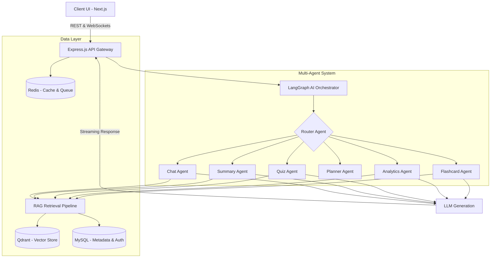
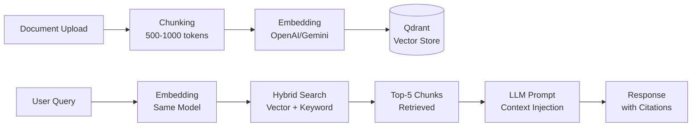
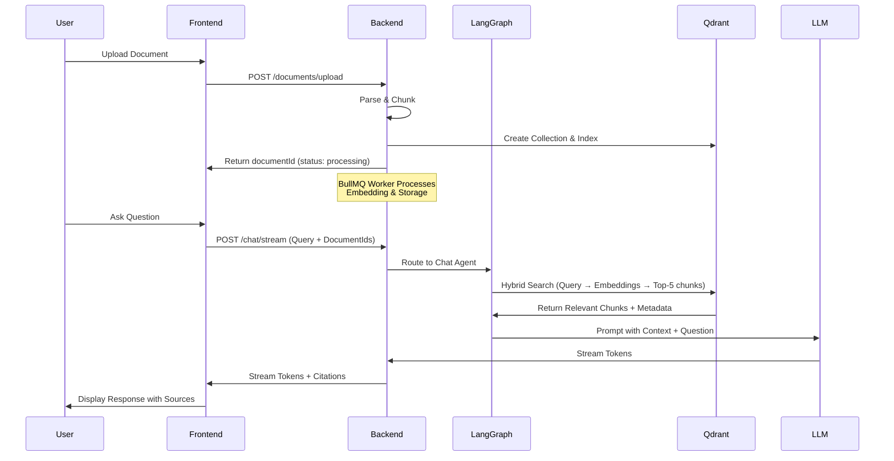
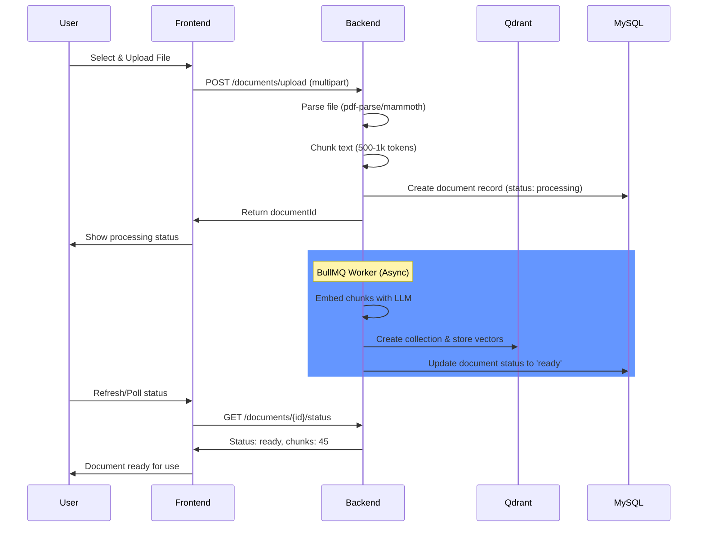
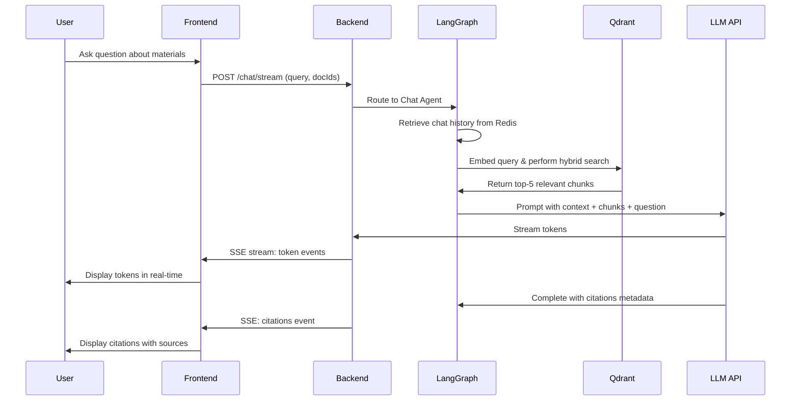

# AI Exam Copilot - AI Study Assistant


**AI Exam Copilot** is a production-ready, autonomous AI-powered exam preparation platform. It transforms static study materials into interactive, multi-modal learning experiences using **Generative AI, Retrieval-Augmented Generation (RAG), and a sophisticated Multi-Agent AI architecture.**

Transform your study materials into personalized learning experiences powered by advanced AI agents. Upload documents, chat with your content, get adaptive quizzes, auto-generated notes, and much more!

---

## Demo

Watch the platform in action:

**[YouTube Demo Video](https://www.youtube.com/watch?v=BUmaEvSaHxM)**

---

## Problem Statement & Solution

### **The Problem**
Students spend the majority of their study time *organizing* and *summarizing* information rather than actually learning it. One-size-fits-all study guides fail to address individual weaknesses, leading to:
- Inefficient studying and lower test scores
- Loss of motivation due to tedious manual work
- Inability to identify weak knowledge areas
- Limited access to personalized tutoring

### **Our Solution**
AI Exam Copilot acts as a **personalized, 24/7 autonomous tutor**. By uploading class notes, PDFs, or slides, students get an instant, tailor-made learning environment with:
- Intelligent document processing and semantic understanding
- Real-time conversational tutoring with source citations
- Adaptive quizzes that adjust to your performance level
- AI-generated study plans optimized for your schedule
- Learning analytics to identify and address knowledge gaps

---

## Key Features

### **Smart Document Processing**
Upload PDFs, DOCX, PPTs, or raw text. The system automatically extracts, chunks, and embeds the content for deep semantic understanding.

### **Conversational RAG Tutor**
Chat directly with your study materials. Ask complex questions and get answers with accurate source citations from your documents.

### **Automated Summaries & Notes**
Instantly generate:
- Quick revision sheets (bullet points & key formulas)
- Detailed comprehensive notes (with subheadings)
- Last-minute high-yield concept sheets

### **Intelligent Flashcards**
AI-generated Q/A and cloze (fill-in-the-blank) flashcards with:
- Automatic difficulty tagging
- Spaced repetition scheduling
- Optimal for active recall learning

### **Adaptive Quizzes**
- Generates targeted MCQs based on course material
- Difficulty adjustment based on your performance
- Detailed explanations for incorrect answers
- Identifies weak topics for focused revision

### **Dynamic Study Planner**
Input your exam dates and available study hours, and the Planner Agent builds an optimized daily revision schedule with spaced repetition cycles.

### **Learning Analytics**
The Analytics Agent:
- Tracks your quiz performance and progress
- Detects weak knowledge areas
- Provides actionable insights for improvement
- Recommends topics to review

---

## Tech Stack

### **Frontend**
| Technology | Purpose |
|-----------|---------|
| **Next.js 16** | React framework with App Router |
| **React 19** | UI library |
| **TypeScript** | Type-safe development |
| **Tailwind CSS** | Utility-first styling |
| **shadcn/ui** | High-quality UI components |
| **Framer Motion & GSAP** | Smooth animations |
| **Zustand** | Client state management |
| **React Query** | Server state caching |
| **Recharts** | Data visualization |

### **Backend**
| Technology | Purpose |
|-----------|---------|
| **Node.js** | JavaScript runtime |
| **Express.js** | Web framework |
| **TypeScript** | Type-safe development |
| **LangChain** | AI/LLM integrations |
| **LangGraph** | Multi-agent orchestration |
| **BullMQ** | Job queue system |
| **pdf-parse, mammoth, officeparser** | Document processing |
| **bcryptjs** | Password hashing |
| **JWT** | Authentication tokens |

### **AI & LLMs**
| Technology | Purpose |
|-----------|---------|
| **OpenAI** | GPT models for generation |
| **Google Gemini** | Alternative LLM provider |
| **OpenAI Embedding** | Document vectorization |
| **Google Embedding** | Alternative embeddings |

### **Databases & Infrastructure**
| Technology | Purpose |
|-----------|---------|
| **Qdrant** | Vector database for RAG |
| **MySQL** | Relational database (users, history, analytics) |
| **Redis** | Caching & session storage |
| **BullMQ** | Asynchronous task processing |
| **WebSockets/SSE** | Real-time streaming responses |

---

## Backend Architecture & System Design

### **High-Level System Diagram**


### **Core Components**

#### 1. **API Gateway (Express.js)**
- Handles REST endpoints for auth, documents, study tools
- Manages WebSocket/SSE connections for real-time streaming
- Enforces authentication & rate limiting
- Routes requests to LangGraph orchestrator

#### 2. **Multi-Agent System (LangGraph)**

The system uses **7 specialized AI agents**, each handling a specific task:

| Agent | Responsibility |
|-------|-----------------|
| **Router Agent** | Classifies user intent and routes to appropriate agent |
| **Chat Agent** | Contextual Q&A with source citations |
| **Summary Agent** | Condenses documents into study guides |
| **Flashcard Agent** | Extracts concepts for spaced repetition cards |
| **Quiz Agent** | Generates adaptive MCQs |
| **Planner Agent** | Creates optimized study schedules |
| **Analytics Agent** | Identifies knowledge gaps & recommends focus areas |

#### 3. **RAG Retrieval Pipeline**


#### 4. **Document Processing Pipeline**
- **Upload:** User uploads PDF, DOCX, PPT, or TXT
- **Parsing:** Extract text using pdf-parse, mammoth, or officeparser
- **Chunking:** Split into 500-1000 token chunks with overlap
- **Embedding:** Convert to vectors using OpenAI/Gemini APIs
- **Storage:** Store vectors + metadata in Qdrant
- **Indexing:** Update MySQL metadata table

#### 5. **Asynchronous Task Processing (BullMQ)**
Heavy operations are offloaded to workers:
- Document embedding & ingestion
- Flashcard generation
- Quiz creation
- Study plan generation
- Analytics calculations

Tasks are queued in Redis and processed asynchronously to keep API responsive.

#### 6. **Database Schema**
- **MySQL:** Users, documents, flashcards, quiz attempts, analytics
- **Qdrant:** Document chunks as vectors with rich metadata (documentId, userId, pageNumber, topicTags)

---

## Implementation Approach & Workflow

### **User Journey**



### **Key Implementation Details**

1. **Streaming Architecture**
   - Uses Server-Sent Events (SSE) for token-by-token streaming
   - Frontend renders tokens in real-time for perceived low latency
   - Citations provided at the end of response

2. **Context Compression**
   - Chat history is stored in Redis with TTL
   - When chat exceeds threshold, Summary Agent compresses history
   - Keeps context window efficient for LLM calls

3. **Adaptive Learning**
   - Quiz performance tracked in MySQL
   - Analytics Agent analyzes scores by topic
   - Recommendation Agent suggests focus areas
   - Planner Agent adjusts study schedule based on performance

4. **Security & Authentication**
   - JWT tokens (Access + Refresh) for stateless auth
   - Bcrypt hashing for passwords
   - Rate limiting to prevent abuse
   - CORS enabled for frontend origin

---

## Features & Functionalities

### **1. Document Management**
- Upload PDFs, DOCX, PPTs, TXT, Markdown files
- Automatic OCR for scanned PDFs
- Background processing with progress tracking
- Support for multiple documents per session

### **2. Study Tools**
- **Smart Chat:** Ask questions about your materials
- **Note Generation:** Create quick revision sheets or detailed notes
- **Flashcard Deck:** Auto-generated spaced repetition cards
- **Quiz Generator:** Create custom tests with difficulty levels
- **Study Planner:** Personalized revision schedules
- **Performance Analytics:** Track progress and identify gaps

### **3. Real-Time Features**
- Token streaming for live responses
- WebSocket connections for bi-directional communication
- Server-Sent Events (SSE) for streaming chat
- Live quiz feedback

### **4. Learning Intelligence**
- Spaced repetition algorithm for flashcards
- Adaptive difficulty adjustment for quizzes
- Performance-based topic recommendations
- Knowledge gap identification

---

## 🔌 APIs / Models / Tools Used

### **LLM Models**

#### **Chat & Generation**
- **Google Gemini 3.5 Flash** (Primary) - Fast, cost-effective
- **OpenAI GPT-4** (Alternative) - Higher quality

#### **Embeddings**
- **OpenAI text-embedding-3-small** - 1536 dimensions
- **Google text-embedding-004** - 768 dimensions

### **Tools & APIs**

| Tool | Purpose |
|------|---------|
| **Qdrant Vector DB** | Semantic search & RAG storage |
| **LangChain** | LLM abstractions & integrations |
| **LangGraph** | Agentic workflow orchestration |
| **BullMQ** | Distributed job queue |
| **pdf-parse** | PDF text extraction |
| **mammoth** | DOCX parsing |
| **officeparser** | PPT parsing |
| **bcryptjs** | Cryptographic hashing |
| **JWT** | Token generation & validation |

### **External APIs**
- Google Gemini API
- OpenAI API
- Redis (local or managed)
- MySQL (local or RDS)

---

## Setup Instructions to Run Locally

### **Prerequisites**
Before you begin, ensure you have the following installed:

- **Node.js** v20+ ([Download](https://nodejs.org/))
- **npm** or **yarn** package manager
- **MySQL** v8+ ([Download](https://dev.mysql.com/downloads/mysql/))
- **Redis** ([Download](https://redis.io/download) or use Docker)
- **Qdrant Vector DB** ([Download](https://qdrant.tech/documentation/quick-start/) or use Docker)
- **Git** for cloning the repository

### **Step 1: Clone the Repository**

```bash
git clone https://github.com/prudhvi-1618/AI-Study-Assistant.git
cd AI-Study-Assistant
```

### **Step 2: Setup Databases (Using Docker - Recommended)**

If you have Docker installed, you can spin up MySQL, Redis, and Qdrant quickly:

```bash
# Create docker-compose.yml in the project root
cd backend

# Start all services
docker-compose up -d
```

Or manually:

#### **Option A: MySQL Setup**
```bash
# On Windows (if MySQL is installed)
mysql -u root -p
# Then execute the schema setup

# Or using Docker
docker run --name mysql-study-db \
  -e MYSQL_ROOT_PASSWORD=root \
  -e MYSQL_DATABASE=study_assistant \
  -p 3306:3306 -d mysql:8.0
```

#### **Option B: Redis Setup**
```bash
# Using Docker (Recommended)
docker run --name redis-study \
  -p 6379:6379 -d redis:7-alpine
```

#### **Option C: Qdrant Setup**
```bash
# Using Docker
docker run --name qdrant-study \
  -p 6333:6333 \
  -p 6334:6334 \
  -v qdrant_storage:/qdrant/storage \
  -d qdrant/qdrant
```

### **Step 3: Backend Setup**

```bash
cd backend

# Install dependencies
npm install

# Create .env file (copy from .env.example)
cp .env.example .env

# Edit .env with your configuration (see next section)
nano .env

# Run database migrations
npm run db:migrate

# Start development server
npm run dev

# Server should be running at http://localhost:3001
```

### **Step 4: Frontend Setup**

```bash
cd ../frontend

# Install dependencies
npm install

# Create .env.local file
cp .env.example .env.local

# Edit .env.local with your backend URL
# NEXT_PUBLIC_API_URL=http://localhost:3001/api/v1

# Start development server
npm run dev

# Frontend should be running at http://localhost:3000
```

### **Step 5: Verify Setup**

```bash
# Check backend API
curl http://localhost:3001/api/v1/health

# Open frontend in browser
open http://localhost:3000
```

---

## Environment Variables Required

### **Backend (.env file)**

Create a `.env` file in the `backend/` directory with the following variables:

```env
# Server Configuration
PORT=3001
NODE_ENV=development

# Database - MySQL
DB_HOST=localhost
DB_PORT=3306
DB_USER=root
DB_PASSWORD=your_mysql_password
DB_NAME=study_assistant

# Redis Configuration
REDIS_HOST=localhost
REDIS_PORT=6379
REDIS_PASSWORD=                    # Leave empty if no password

# Qdrant Vector Database
QDRANT_URL=http://localhost:6333
QDRANT_COLLECTION_NAME=document_embeddings

# Authentication - JWT (Generate 32+ char random strings)
ACCESS_TOKEN_SECRET=your_32_char_secret_key_here_min_32_chars
REFRESH_TOKEN_SECRET=your_another_32_char_secret_key_here
ACCESS_TOKEN_TTL=15m
REFRESH_TOKEN_TTL=7d

# Password Security
BCRYPT_ROUNDS=12

# File Upload Configuration
MAX_FILE_SIZE_MB=50
ALLOWED_FILE_TYPES=pdf,docx,txt,pptx,md

# AI Models & Embeddings
EMBEDDING_MODEL=gemini-embedding-2-preview
EMBEDDING_BATCH_SIZE=100
FLASHCARD_GENERATION_MODEL=gemini-3.5-flash
QUIZ_GENERATION_MODEL=gemini-3.5-flash
CHAT_MODEL=gemini-3.5-flash
SUMMARY_MODEL=gemini-3.5-flash

# Chat Configuration
CHAT_MAX_HISTORY_MESSAGES=20
CHAT_MEMORY_SUMMARY_THRESHOLD=10
REDIS_CHAT_MEMORY_TTL=86400         # 24 hours
REDIS_SUMMARY_CACHE_TTL=3600        # 1 hour

# RAG Configuration
MAX_CONTEXT_CHUNKS=5

# Task Processing
BULLMQ_CONCURRENCY=3

# Streaming
STREAMING_ENABLED=true

# Cache TTL
REDIS_CACHE_TTL_SECONDS=3600

# Limits
MAX_FLASHCARDS_PER_DECK=50
MAX_QUIZ_QUESTIONS=30

# LLM API Keys
# Google Gemini (Primary)
GEMINI_API_KEY=your_gemini_api_key_here
GOOGLE_API_KEY=your_google_api_key_here

# OpenAI (Alternative)
OPENAI_API_KEY=your_openai_api_key_here

# Optional: Redis URL (if using managed Redis)
REDIS_URL=
```

### **Frontend (.env.local file)**

Create a `.env.local` file in the `frontend/` directory:

```env
# Backend API URL
NEXT_PUBLIC_API_URL=http://localhost:3001/api/v1

# Application Environment
NEXT_PUBLIC_ENV=development

# Optional: Analytics or monitoring
# NEXT_PUBLIC_ANALYTICS_ID=your_analytics_id
```

### **How to Generate JWT Secrets**

Generate strong random strings for JWT secrets:

```bash
# Using Node.js
node -e "console.log(require('crypto').randomBytes(32).toString('hex'))"

# Using OpenSSL
openssl rand -hex 32

# On Windows PowerShell
[System.Convert]::ToBase64String([System.Security.Cryptography.RandomNumberGenerator]::GetBytes(32))
```

---

## Installation Steps

### **Full Installation with Docker (Easiest)**

```bash
# 1. Clone repository
git clone https://github.com/prudhvi-1618/AI-Study-Assistant.git
cd AI-Study-Assistant

# 2. Create environment files
cp backend/.env.example backend/.env
cp frontend/.env.example frontend/.env.local

# 3. Edit .env files with your API keys and database credentials
# - Set GEMINI_API_KEY or OPENAI_API_KEY
# - Configure database credentials

# 4. Start all services with Docker Compose
cd backend
docker-compose up -d

# 5. Run database migrations (from backend directory)
npm install
npm run db:migrate

# 6. Start frontend (in new terminal)
cd ../frontend
npm install
npm run dev

# 7. Access the application
# Frontend: http://localhost:3000
# Backend API: http://localhost:3001/api/v1
```

### **Manual Installation (Step-by-Step)**

#### **For macOS/Linux:**

```bash
# 1. Prerequisites
brew install node mysql redis

# 2. Clone and setup backend
git clone <repo-url>
cd AI-Study-Assistant/backend
npm install
cp .env.example .env
# Edit .env with your configuration

# 3. Start databases
redis-server &
mysql -u root -p < ../schema.sql &

# 4. Run migrations
npm run db:migrate

# 5. Start backend
npm run dev &

# 6. Setup frontend
cd ../frontend
npm install
cp .env.example .env.local
npm run dev
```

#### **For Windows:**

```bash
# 1. Ensure MySQL, Redis installed via installers or chocolatey
choco install nodejs mysql redis

# 2. Start Services
# MySQL - via Services or command line
net start MySQL80

# Redis - via Services or command line
redis-server

# 3. Clone repository
git clone <repo-url>
cd AI-Study-Assistant

# 4. Setup Backend
cd backend
npm install
copy .env.example .env
# Edit .env file

npm run db:migrate
npm run dev

# 5. Setup Frontend (new terminal)
cd ..\frontend
npm install
copy .env.example .env.local
npm run dev
```

---

## Running the Application

### **Development Mode**

```bash
# Terminal 1: Start Backend (from backend/ directory)
npm run dev

# Terminal 2: Start Frontend (from frontend/ directory)
npm run dev

# Terminal 3 (Optional): Monitor BullMQ jobs
npm run queue:monitor
```

### **Production Build**

```bash
# Backend
cd backend
npm run build
npm start

# Frontend
cd frontend
npm run build
npm start
```

---

## Database Schema Overview

### **MySQL Tables**

- **users:** User authentication and profile data
- **documents:** Uploaded study materials metadata
- **flashcards:** AI-generated flashcards (Q&A and Cloze types)
- **quiz_attempts:** User quiz performance tracking
- **analytics:** Learning metrics and performance data

### **Qdrant Collections**

- **document_embeddings:** Vector embeddings of document chunks with metadata (documentId, userId, pageNumber, topicTags, text)

See [DATABASE_SCHEMA.md](./DATABASE_SCHEMA.md) for detailed schema information.

---

## API Endpoints Overview

### **Authentication**
- `POST /auth/register` - Create new user account
- `POST /auth/login` - User login

### **Documents**
- `POST /documents/upload` - Upload study material
- `GET /documents/:id/status` - Check upload status
- `GET /documents` - List user's documents

### **Chat**
- `POST /chat/stream` - Chat with study materials (SSE streaming)

### **Study Tools**
- `POST /study/generate-flashcards` - Generate flashcard deck
- `POST /study/generate-quiz` - Create adaptive quiz
- `POST /study/generate-summary` - Create study notes
- `POST /study/generate-plan` - Create study schedule

### **Analytics**
- `GET /analytics/performance` - Get learning metrics
- `GET /analytics/weak-topics` - Identify knowledge gaps

See [API_SPECIFICATION.md](./API_SPECIFICATION.md) for complete API documentation.

---

## Troubleshooting

### **Common Issues**

#### **Port Already in Use**
```bash
# Kill process using port 3001 (Backend)
lsof -ti:3001 | xargs kill -9

# Kill process using port 3000 (Frontend)
lsof -ti:3000 | xargs kill -9
```

#### **Redis Connection Error**
```bash
# Verify Redis is running
redis-cli ping
# Should return: PONG

# If not, start Redis
redis-server
```

#### **MySQL Connection Error**
```bash
# Verify MySQL service
sudo systemctl status mysql

# Start MySQL if needed
sudo systemctl start mysql

# Check credentials in .env file
```

#### **Qdrant Connection Error**
```bash
# Verify Qdrant is running
curl http://localhost:6333/health

# If using Docker, check container
docker ps | grep qdrant
```

#### **API Key Errors**
- Ensure GEMINI_API_KEY or OPENAI_API_KEY is set in .env
- Verify API keys are valid and have sufficient quota
- Check for typos in environment variable names

---

## Project Structure

```
AI-Study-Assistant/
├── backend/                  # Express.js server
│   ├── src/
│   │   ├── ai/              # AI agents and LangGraph graphs
│   │   ├── config/          # Configuration files
│   │   ├── modules/         # Feature modules (auth, chat, etc.)
│   │   ├── shared/          # Shared utilities, types, middleware
│   │   ├── uploads/         # Uploaded file storage
│   │   └── websocket/       # WebSocket handlers
│   ├── .env.example         # Environment variables template
│   └── package.json         # Backend dependencies
│
├── frontend/                # Next.js app
│   ├── src/
│   │   ├── app/            # App Router pages
│   │   ├── components/     # React components
│   │   ├── hooks/          # Custom hooks
│   │   ├── lib/            # Utilities and API client
│   │   └── providers/      # Context providers
│   ├── .env.example        # Frontend environment template
│   └── package.json        # Frontend dependencies
│
├── ARCHITECTURE.md         # Detailed architecture documentation
├── DATABASE_SCHEMA.md      # Database schema documentation
├── API_SPECIFICATION.md    # Complete API documentation
└── README.md              # This file
```

---

##  System Flow Diagrams

### **Document Upload Flow**


### **Chat Query Flow**


---

## Performance Metrics

The system is designed to handle:
- **Concurrent Users:** 100+ simultaneous connections
- **Document Size:** Up to 50MB per file
- **Query Latency:** <2 seconds for RAG queries (with streaming)
- **Embedding Speed:** 1000+ chunks per minute
- **Throughput:** 50+ chats/quizzes per minute

---

## Security Features

- **JWT Authentication:** Stateless, secure token-based auth
- **Password Hashing:** Bcrypt with 12 rounds
- **Rate Limiting:** Prevents abuse and DDoS
- **CORS Protection:** Frontend origin validation
- **Input Validation:** Zod schema validation on all inputs
- **File Upload Security:** Type & size restrictions
- **SQL Injection Prevention:** Parameterized queries (MySQL2)
- **XSS Protection:** React's built-in escaping + sanitization

---

## Additional Documentation

- [ARCHITECTURE.md](./ARCHITECTURE.md) - Detailed system architecture
- [DATABASE_SCHEMA.md](./DATABASE_SCHEMA.md) - Complete database schema
- [API_SPECIFICATION.md](./API_SPECIFICATION.md) - Full API documentation
- [Backend AGENTS.md](./backend/AGENTS.md) - AI agents specification
- [Frontend ARCHITECTURE.md](./frontend/ARCHITECTURE.md) - Frontend design details

---

## Deployment

### **Recommended Deployment Stack**
- **Frontend:** Vercel, Netlify, or AWS Amplify
- **Backend:** AWS EC2, DigitalOcean, Heroku, or Railway
- **Databases:**
  - MySQL: AWS RDS or managed database service
  - Redis: AWS ElastiCache or Redis Cloud
  - Qdrant: Qdrant Cloud or self-hosted

### **Deployment Guides**
See individual deployment configurations in backend/deployment and frontend/deployment directories.

---

## Support & Contact

For issues, feature requests, or contributions:
- **GitHub Issues:** [Report a bug](https://github.com/prudhvi-1618/AI-Study-Assistant/issues)
- **Discussions:** [Ask questions](https://github.com/prudhvi-1618/AI-Study-Assistant/discussions)

---

## License

This project is licensed under the ISC License. See the LICENSE file for details.

---

## Acknowledgments

Built by Prudhvi

**Technologies & Libraries:**
- LangChain & LangGraph for AI orchestration
- Next.js for modern frontend development
- Express.js for robust backend
- Qdrant for semantic search capabilities
- All open-source contributors and maintainers

---

**Transform your study materials into personalized learning experiences. Start using AI Exam Copilot today!** 

[⬆ Back to Top](#-ai-exam-copilot---ai-study-assistant)
```

### 2. Backend Setup
```bash
cd backend
npm install

# Set up environment variables
cp .env.example .env
# Fill in your OpenAI/Gemini API keys, DB credentials, and Redis/Qdrant URLs

# Run database migrations
npm run db:migrate

# Start the development server
npm run dev
```

### 3. Frontend Setup
Open a new terminal window:
```bash
cd frontend
npm install

# Start the Next.js development server
npm run dev
```
The application will be available at `http://localhost:3000`.

---

## What's Next? (Future Roadmap)

We plan to take AI Exam Copilot to the next level with:
- **Voice Tutor Mode:** Real-time conversational studying using speech-to-text.
- **Handwritten Notes OCR:** Snap a picture of whiteboard or paper notes to instantly digitize and embed them.
- **Multiplayer Learning:** Real-time collaborative study rooms where friends can quiz each other with AI moderation.

---
