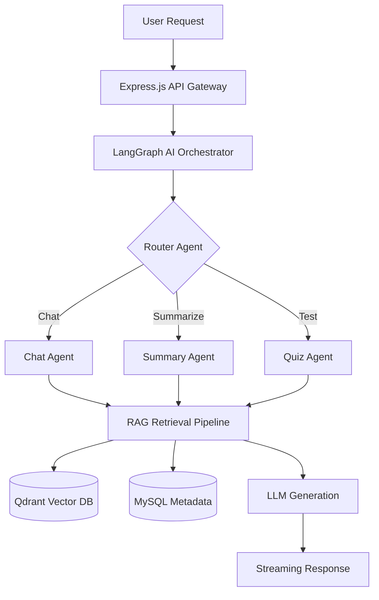

# AI Exam Copilot (AI Study Assistant)


**AI Exam Copilot** is a production-ready, autonomous AI-powered exam preparation platform. It transforms static study materials into interactive, multi-modal learning experiences using **Generative AI, Retrieval-Augmented Generation (RAG), and a sophisticated Multi-Agent AI architecture.**

---

## The Problem & Our Solution

**The Problem:** Students spend the majority of their study time *organizing* and *summarizing* information rather than actually learning it. One-size-fits-all study guides fail to address individual weaknesses, leading to inefficient studying and lower test scores.

**Our Solution:** AI Exam Copilot acts as a personalized, 24/7 autonomous tutor. By uploading class notes, PDFs, or slides, students get an instant, tailor-made learning environment. The system dynamically generates study plans, adaptive quizzes, and smart flashcards, while a multi-agent AI system provides real-time tutoring and performance analytics.

---

## Key Features

- **Smart Document Processing:** Upload PDFs, DOCX, PPTs, or raw text. The system automatically extracts, chunks, and embeds the content for deep semantic understanding.
- **Conversational RAG Tutor:** Chat directly with your study materials. Ask complex questions and get answers with accurate source citations.
- **Automated Summaries & Notes:** Instantly generate exam-focused notes, quick revision sheets, or detailed explanations from heavy textbooks.
- **Intelligent Flashcards:** AI-generated Q/A and cloze flashcards with difficulty tagging, built around active recall and spaced repetition.
- **Adaptive Quizzes:** Generates targeted MCQs based on your course material. The AI adjusts the difficulty based on your performance and explains incorrect answers.
- **Dynamic Study Planner:** Input your exam dates and available hours, and the Planner Agent will build an optimized, daily revision schedule.
- **Learning Analytics:** The Analytics Agent tracks your performance, detecting weak topics and providing actionable insights for improvement.

---

## 🛠 Tech Stack

We built AI Exam Copilot with a robust, modern tech stack designed for scale and performance.

### **Frontend**
- **Framework:** Next.js (App Router), React 19
- **Styling & UI:** Tailwind CSS, shadcn/ui, Framer Motion, GSAP
- **Data Fetching & State:** Zustand, React Query
- **Data Visualization:** Recharts

### **Backend**
- **Framework:** Node.js, Express.js (TypeScript)
- **AI Orchestration:** LangChain, LangGraph
- **LLMs:** OpenAI & Google Gemini APIs
- **Document Processing:** pdf-parse, mammoth, officeparser

### **Databases & Infrastructure**
- **Vector Database:** Qdrant (for RAG & Semantic Search)
- **Relational Database:** MySQL (for Users, History & Analytics)
- **Caching & Queues:** Redis & BullMQ (for asynchronous heavy AI tasks)
- **Real-time:** WebSockets / Server-Sent Events (SSE) for streaming AI responses

---

## Multi-Agent AI Architecture

Instead of a simple chatbot, our backend utilizes **LangGraph** to orchestrate a team of specialized AI agents:

1. **Router Agent:** Classifies user intent and routes tasks.
2. **Chat Agent:** Handles contextual multi-document reasoning.
3. **Summary Agent:** Condenses knowledge into consumable revision sheets.
4. **Flashcard Agent:** Extracts core concepts for spaced repetition.
5. **Quiz Agent:** Creates adaptive MCQs to test retention.
6. **Planner Agent:** Optimizes study time based on deadlines.
7. **Analytics Agent:** Discovers knowledge gaps and recommends focus areas.

### **System Flow**


---

## Running the Project Locally

Follow these steps to run the application on your local machine.

### Prerequisites
- Node.js (v20+)
- Redis (for BullMQ queues)
- MySQL
- Qdrant (can be run via Docker)

### 1. Clone the repository
```bash
git clone https://github.com/prudhvi-1618/AI-Study-Assistant.git
cd AI-Study-Assistant
```

### 2. Backend Setup
```bash
cd backend
npm install

# Set up environment variables
cp .env.example .env
# Fill in your OpenAI/Gemini API keys, DB credentials, and Redis/Qdrant URLs

# Run database migrations
npm run db:migrate

# Start the development server
npm run dev
```

### 3. Frontend Setup
Open a new terminal window:
```bash
cd frontend
npm install

# Start the Next.js development server
npm run dev
```
The application will be available at `http://localhost:3000`.

---

## What's Next? (Future Roadmap)

We plan to take AI Exam Copilot to the next level with:
- **Voice Tutor Mode:** Real-time conversational studying using speech-to-text.
- **Handwritten Notes OCR:** Snap a picture of whiteboard or paper notes to instantly digitize and embed them.
- **Multiplayer Learning:** Real-time collaborative study rooms where friends can quiz each other with AI moderation.

---
